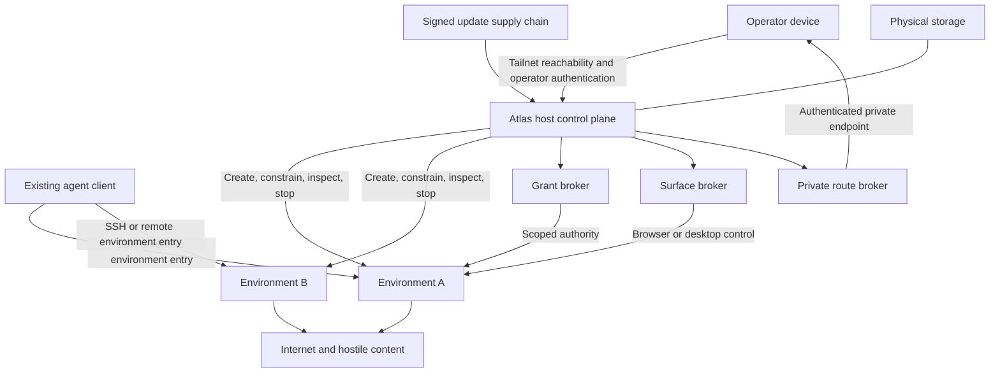

# Atlas threat model

Status: initial physical-host threat model, revised August 2026

## Overview

Atlas turns a dedicated physical Linux computer into a remotely operated host
for existing agent clients. The intended host provides isolated environments,
delegated grants, observable browser or desktop surfaces, private routes, and
managed recovery without becoming an agent conversation or coding product.

This repository does not yet implement that product. It contains design
contracts and a bounded NixOS spike. The spike defines Atlas state roots,
control and environment resource slices, root-only Nix authority, interactive
or runtime-secret Tailscale enrollment, a live physical ISO, and two hardened
demonstration processes. It does not contain an environment manager, browser,
credential broker, route proxy, audit service, persistent installer, or update
controller.

Threats below are requirements and hypotheses unless the evidence column says a
control is implemented and tested. They are not confirmed vulnerabilities.

### Components and source evidence

| Component | Current role | Evidence |
| --- | --- | --- |
| Atlas host module | Declares state roots, host contract, Tailscale adapter, root-only Nix authority, control/environment slices, and accounts | `nixos/modules/atlas-host.nix` |
| Spike configuration | Enables Tailscale and runs two hardened demonstration environment processes | `nixos/configurations/spike-host.nix` |
| Host-contract tests | Check contract intent versus implementation, static configuration, absence of OpenSSH, generated state modes and ownership, environment namespaces, root-only Nix, safe option evaluation, and state survival | `nixos/tests/host-contract.nix`, `nixos/tests/module-evaluation.nix` |
| Flake outputs | Build VM test artifacts and a non-persistent live ISO with local-console enrollment instructions | `flake.nix` |

### Effective resources

| Deployment or workflow | Resource or capability | Configuration and precedence | Safe effective value or location | Readers, writers, or recipients | Enforcing control | Evidence or unknowns |
| --- | --- | --- | --- | --- | --- | --- |
| All spike hosts | Mutable Atlas state | fixed v0 `atlas.host.dataRoot` | `/var/lib/atlas` with named subdirectories; separate storage must be mounted at that path | root and `atlas-control`; dynamic demonstration identities; future environment-specific owners | exact external-path option constraint and metadata-derived systemd-tmpfiles rules | Implemented and evaluation-tested; not an encrypted partition: `nixos/modules/atlas-host.nix`, `nixos/tests/module-evaluation.nix` |
| Interactive enrollment | Tailnet and Tailscale SSH authority | `sudo atlas-enroll` invokes `tailscale up --qr --ssh` | Tailscale-managed state; no auth key embedded in the image | root, `tailscaled`, Tailscale control plane | local root plus tailnet policy | Implemented helper; live enrollment not yet integration-tested: `nixos/modules/atlas-host.nix` |
| Automated enrollment | Tailscale auth key | operator-selected `atlas.host.tailscale.authKeyFile` | canonical external runtime path resolving outside `/nix/store` | root and NixOS Tailscale autoconnect service | external-path option type, dot-segment and store rejection, runtime resolution check, and file permissions supplied by deployer | Path representation is evaluation-tested; secret lifecycle untested: `nixos/modules/atlas-host.nix`, `nixos/tests/module-evaluation.nix` |
| Host administration | `atlas-operator` authority | password-disabled local account in wheel; passwordless sudo | local OS account, reached only after selected remote enrollment or console access | tailnet identities allowed to log in as `atlas-operator`; anyone with the live ISO console | tailnet policy and physical possession of the live image | High-impact boundary; no Atlas policy layer yet: `nixos/modules/atlas-host.nix`, `flake.nix` |
| Environment demonstrations | Process and loopback namespace | dynamic users, private network, hardened systemd services | separate service identities and network namespaces | each demonstration process only | systemd service sandboxing | Implemented and tested; not an interactive environment backend: `nixos/configurations/spike-host.nix`, `nixos/tests/host-contract.nix` |
| Live physical image | First-boot console | ISO-only console autologin as password-disabled `atlas-operator` with passwordless sudo | ephemeral live system with host-root console authority | person with physical console access | physical possession and ISO-only configuration | Deliberately weak dogfood bootstrap; no persistent-image claim: `flake.nix` |

### Security objective

Assume that agent clients, environment processes, generated code, repositories,
dependencies, browser content, tool output, and remote websites can be
malicious. Atlas should contain their authority to an explicit environment,
prevent silent access to host or operator secrets, keep routes private unless
deliberately shared, preserve evidence for investigation and revocation, and
retain a recovery path when the private network or control plane fails.

### Highest-value assets

- host root authority, update trust roots, and recovery mechanisms
- operator identity, tailnet policy, paired devices, and enrollment authority
- source credentials and derivative grants
- browser cookies, authenticated profiles, recordings, clipboard, and downloads
- source code, uncommitted work, artifacts, and environment state
- route names, targets, authorization, and access history
- audit records and attribution evidence
- disk-encryption and backup keys
- downstream product identities, including Blue and Fabric principals

### Trust zones

The grant, surface, and route brokers are intended components, not current
implementation claims.

## Threat Model, Trust Boundaries, and Assumptions

### Actors and attacker capabilities

- **Legitimate operator:** owns the machine and tailnet, approves authority, and
  performs recovery. The operator can still make dangerous policy mistakes.
- **Environment process:** runs attacker-influenced code and may attempt host
  escape, persistence, exfiltration, or interference with another environment.
- **Agent client or harness:** connects through a normal remote interface but
  may be buggy, compromised, or dishonest about its logical agent identity.
- **Malicious repository or dependency:** controls build scripts, hooks,
  binaries, tests, and package lifecycle operations inside an environment.
- **Remote content attacker:** controls a website, prompt injection, tool
  response, issue, document, or route request seen by an agent.
- **Tailnet peer attacker:** has network membership but not necessarily Atlas
  operator or environment authority.
- **Public-network attacker:** can scan public or LAN interfaces and influence
  untrusted networks but does not initially hold tailnet or device keys.
- **Physical attacker:** steals or accesses an unattended machine or its disk.
- **Supply-chain attacker:** compromises a dependency, build system, update
  channel, package repository, or optional remote service.
- **Resource-exhaustion attacker:** consumes CPU, memory, disk, file descriptors,
  browser processes, recordings, routes, or network capacity.

### Important trust boundaries

1. **Operator device to host:** private reachability does not itself prove Atlas
   operator authority.
2. **Tailnet to local OS account:** permission to log in as `atlas-operator`
   currently yields passwordless sudo and must be treated as host-root access.
3. **Agent client to environment:** client-supplied labels are input, not
   authentication; environment entry must map to an observed kernel identity.
4. **Host control plane to environment:** environments are hostile and cannot
   write policy, host binaries, sockets, audit state, enrollment state, or
   update trust roots.
5. **Environment to environment:** files, processes, profiles, grants, surfaces,
   routes, resources, and activity attribution remain separate.
6. **Environment to grant broker:** an environment obtains only approved
   derivative authority and never the operator's source credential.
7. **Environment to surface:** profiles, automation endpoints, displays,
   clipboard, downloads, screenshots, recordings, and takeover carry sensitive
   authority and data.
8. **Route to private network:** a loopback service becomes reachable across a
   new authentication and routing boundary only after explicit publication.
9. **Environment to internet:** an internet-enabled process can transmit any
   data or bearer capability it can read.
10. **Installed host to update supply chain:** a privileged update can replace
    every local control.
11. **Persistent storage to physical access:** an unattended box may contain
    code, profiles, tokens, logs, and pairing state.

### Security invariants

1. A process cannot gain authority by self-asserting an environment, client,
   agent, task, workspace, or model identifier.
2. A process receives environment capabilities only through an authenticated
   entry that the host binds to a kernel-enforced principal.
3. One environment cannot read, signal, trace, attach to, route through, or use
   another environment's files, profiles, grants, surfaces, or routes by
   default.
4. Ordinary environments cannot modify the Atlas control plane, audit sink,
   update policy, recovery material, or host credential store.
5. Source credentials never enter the Nix store, process arguments, logs, or an
   environment's ordinary filesystem.
6. Materialized bearer secrets are reported as a degraded grant mode. Brokered
   operations and derivative credentials are preferred where supported.
7. A grant is bound to an environment, audience, operations, and expiry and can
   be revoked without granting the environment access to its source secret.
8. A browser profile and its derived session credentials are bound to one
   environment and protected by the surface broker. Atlas accurately reports
   when an automation protocol can export cookies or equivalent authority.
9. Surface observation and control are explicit. At most one party holds
   interactive control, and recording state is visible.
10. Routes are unpublished by default, target only the owning environment, and
    require private authentication unless an explicit public grant exists.
11. Tailnet membership is network reachability, not ambient host, environment,
    grant, surface, or route authorization.
12. Security events are written outside environment control and distinguish
    proven host identity from unverified client annotations.
13. Resource exhaustion in one environment cannot prevent the operator from
    inspecting, stopping, or recovering the host.
14. Authenticated updates preserve declared guarantees or fail visibly with a
    tested recovery path.

### Assumptions and explicit non-guarantees

- The first operator is one administrative trust domain. Hostile public
  multi-tenancy is not assumed.
- Kernel, firmware, selected isolation backend, private-network provider, and
  hardware roots of trust remain trusted dependencies.
- The default developer environment may use the public internet. Atlas v0 does
  not provide data-loss prevention for data that environment may read.
- Browser control is account authority. Atlas cannot prevent an authorized
  environment from misusing the website actions it has been granted.
- Tailscale policy is externally administered. Atlas cannot prove a tailnet rule
  is safe merely because the node is enrolled.
- Client-owned terminals and arbitrary processes are not reconstructed after a
  disconnect or reboot unless explicitly declared and supervised.
- The current spike has no persistent disk encryption, browser, grant broker,
  route proxy, environment login boundary, audit implementation, signed Atlas
  releases, or physical-hardware evidence.
- The live ISO's local-console autologin is a dogfood bootstrap, not an
  acceptable persistent appliance control.

## Attack Surface, Mitigations, and Attacker Stories

| Priority | Scenario and capability gain | Prerequisites | Impact | Existing controls | Required mitigation | Evidence |
| --- | --- | --- | --- | --- | --- | --- |
| Critical hypothesis | Tailnet policy lets an unintended peer log in as `atlas-operator`, gaining passwordless sudo and host root | enrolled host plus permissive network and SSH policy | total host, environment, credential, and update compromise | password-disabled local account, Tailscale-only intended path, no OpenSSH | require a dedicated Atlas tailnet tag, narrow source identities, fresh check for administrator login, device revocation, and local recovery | Current authority is visible in `nixos/modules/atlas-host.nix` and `flake.nix`; tailnet policy is external and unverified |
| Critical hypothesis | Update or build compromise replaces the Atlas host or enrollment helper | compromised nixpkgs input, release process, signing key, or builder | fleet-wide privileged code execution | pinned flake input and root-only Nix authority | signed release metadata, provenance, staged rollout, health checks, anti-downgrade, and offline recovery | Pin and Nix policy implemented in `flake.lock` and `nixos/modules/atlas-host.nix`; release controls absent |
| High hypothesis | An environment escapes through mounts, devices, capabilities, ptrace, namespaces, or a privileged socket | hostile process inside environment | host root or another environment's data and authority | demonstration services use dynamic users, private network, dropped capabilities, and read-only host protections | choose and test an interactive environment backend; deny control sockets; isolate writable state, devices, IPC, and caches | Demonstration only: `nixos/configurations/spike-host.nix` |
| High hypothesis | A second environment reads another environment's browser profile, grant, recording, or code | two persistent environments and an incomplete filesystem boundary | cross-environment identity and data theft | top-level sensitive state roots have restrictive ownership where implemented | per-environment ownership or isolated mount trees; cross-environment regression tests; immutable shared caches | Top-level modes implemented by `nixos/modules/atlas-host.nix`; per-environment backend absent |
| High hypothesis | A raw browser-debug endpoint lets an authorized environment export cookies or reusable session credentials | persistent authenticated profile plus broad automation protocol | durable account takeover outside Atlas | none implemented | capability-specific browser adapters, authenticated local endpoints, protected profile filesystem, narrower action-only mode for high-trust identities, fast browser patching | Design requirement only |
| High hypothesis | Prompt injection obtains a broad or long-lived token and exfiltrates it | credential broker or materialized secret plus internet egress | downstream account or repository compromise | runtime secret root reserved; canonical external-path and resolved-target constraints for enrollment key | narrow derivative grants, out-of-band approval, audience binding, revocation, no secret logging, degraded-mode reporting | General broker absent; enrollment-key path tests at `nixos/tests/module-evaluation.nix` |
| High hypothesis | A route publishes an administrative or unintended port, pivots to host metadata, or targets another environment | future route broker with attacker-controlled target | private data exposure, SSRF, or cross-environment access | no route is currently implemented or exposed | explicit publication, environment-bound upstream validation, private authentication, expiry, rate limits, and public sharing as separate grant | Design requirement only |
| High hypothesis | Physical theft exposes source, browser sessions, grants, tailnet state, or recovery material | persistent unencrypted installation | offline credential and data theft | current live ISO is ephemeral | full-disk encryption, hardware-backed sealing where supportable, separate sensitive stores, encrypted backups, remote revocation, secure reset | Persistent installer and encryption absent |
| Medium hypothesis | Tailscale auth key leaks from a declarative build or broadly readable runtime file | automated enrollment using `authKeyFile` | unauthorized node enrollment or tailnet access within key scope | canonical external runtime-path type, Nix-store and resolved-target rejection, and evaluation regression | require short-lived scoped keys, strict file mode, deletion after enrollment, rotation, and no logging | Nix-path, store-path, and dot-segment representations rejected by `nixos/tests/module-evaluation.nix`; runtime lifecycle remains open |
| Medium hypothesis | A malicious environment exhausts resources and blocks inspection or recovery | interactive environment with unbounded CPU, memory, tasks, disk, or recordings | host denial of service and possible state loss | separate weighted slices, control-plane memory reservation, systemd-oomd | per-environment quotas, bounded logs and recordings, pressure tests, deterministic quarantine and cleanup | Slice controls in `nixos/modules/atlas-host.nix`; per-environment quotas absent |
| Medium hypothesis | A client label or logical agent identifier is trusted as the environment principal | capability-aware client or local control socket | confused-deputy access to another environment | contract requires kernel identity; no control daemon exists | authenticate peer credentials and boundary membership; bind every grant and route to the observed principal | Design requirement only |
| Medium hypothesis | Local-console autologin on a persistent image gives anyone with physical access host administration | ISO bootstrap copied into installed system | local host-root access | autologin is scoped to the live ISO output | remove autologin from persistent images; use single-use enrollment and authenticated recovery | ISO-only configuration in `flake.nix` |
| Medium hypothesis | An environment deletes or floods activity evidence or places secrets in logged arguments | future audit pipeline plus hostile process | loss of attribution or secondary secret exposure | audit root is control-owned; no audit writer exists | control-plane-owned event path, redaction, rate limits, tamper evidence, off-host export, retention controls | State root in `nixos/modules/atlas-host.nix`; implementation absent |

## Severity Calibration (Critical, High, Medium, Low)

Severity reflects plausible privilege gain and impact on a dedicated agent host.
Internet reachability, cross-environment access, reusable identity theft,
persistence, no-interaction exploitation, and fleet-wide supply-chain reach
raise severity. Explicit operator action, narrow scope, short lifetime, reliable
revocation, and proven recovery may lower it.

### Critical

- unauthenticated or unintended remote control of the Atlas host
- extraction of operator source credentials or unrestricted downstream identity
- compromise of the release channel that silently replaces privileged code on
  many hosts
- Atlas acting as a Blue or Fabric principal solely because it hosts a process

### High

- environment escape to host root or another environment's code, profile, grant,
  surface, or route
- theft of a reusable authenticated browser identity
- a private route becoming publicly reachable with sensitive operations
- durable unauthorized host control through enrollment or recovery

### Medium

- denial of service requiring operator recovery without loss of protected data
- a narrow grant lasting beyond intended expiry but remaining revocable
- low-sensitivity environment metadata crossing an isolation boundary
- local-console bootstrap exposure that requires physical access and affects
  only a disposable live image

### Low

- non-sensitive diagnostic leakage without a meaningful capability gain
- inaccurate capability reporting that causes inconvenience but does not weaken
  a security boundary
- activity gaps for ordinary operations when sensitive state transitions remain
  intact

Transmission by an internet-enabled environment of data within its documented
readable authority is an explicit non-guarantee, not by itself an Atlas
vulnerability. It becomes reportable when Atlas exposes data outside that
authority, leaks a source credential, bypasses an enforced egress policy, or
falsely reports a restriction as active.

Re-evaluate the model when Atlas selects its persistent installer, environment
backend, browser protocol, credential provider, route broker, update mechanism,
or multi-operator model.
